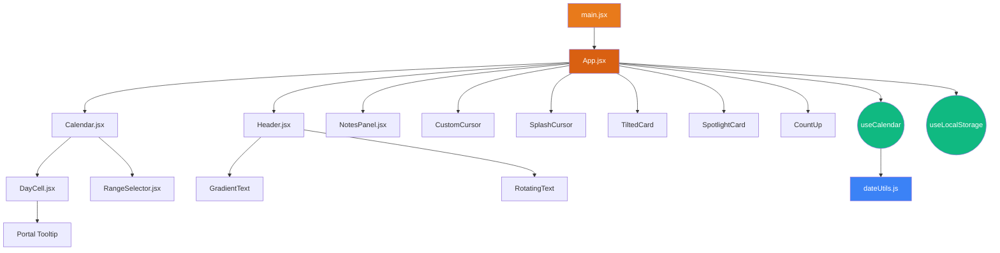
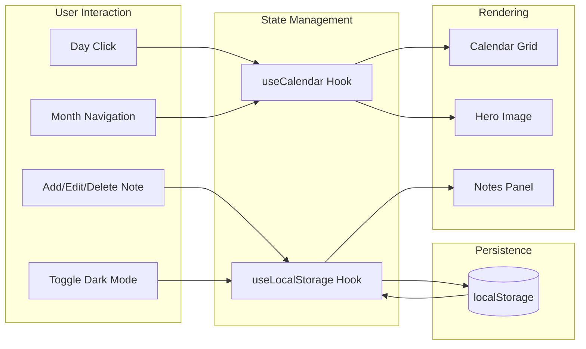
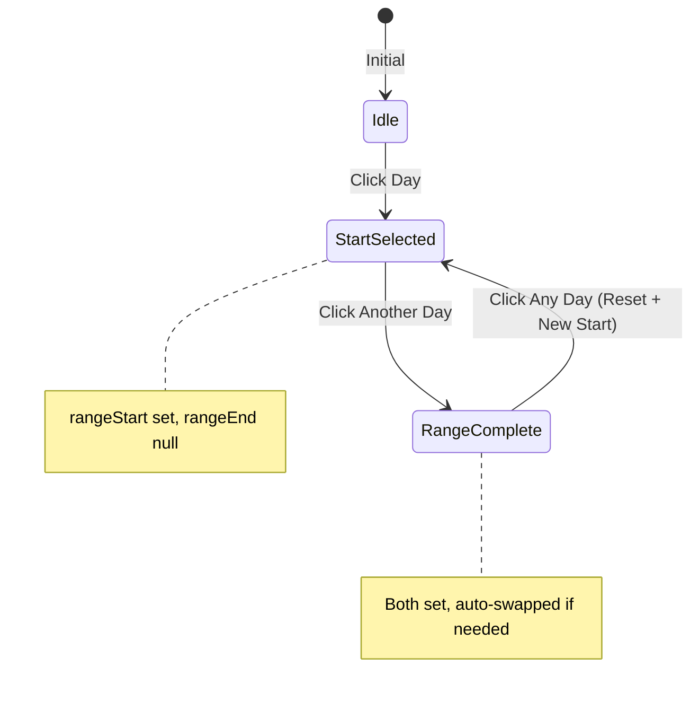

<p align="center">
  
  
  
  
  
</p>

<h1 align="center">📅 InterCalendar</h1>

<p align="center">
  <strong>A highly polished, production-level Interactive Wall Calendar built with React, Tailwind CSS, Framer Motion, and React Bits — featuring date range selection, persistent notes, rich holiday tooltips, and stunning visual effects.</strong>
</p>

<p align="center">
  <em>Strictly frontend only — Zero backend, zero database, zero APIs. All data persisted via localStorage.</em>
</p>

---

## 📑 Table of Contents

| #  | Section                                                    |
|----|------------------------------------------------------------|
| 1  | [Overview](#1-overview)                                    |
| 2  | [Live Demo & Screenshots](#2-live-demo--screenshots)       |
| 3  | [Key Features](#3-key-features)                            |
| 4  | [Tech Stack](#4-tech-stack)                                |
| 5  | [Project Architecture](#5-project-architecture)            |
| 6  | [Module Reference](#6-module-reference)                    |
| 7  | [Component Documentation](#7-component-documentation)      |
| 8  | [Custom Hooks](#8-custom-hooks)                            |
| 9  | [Utility Functions](#9-utility-functions)                  |
| 10 | [React Bits Integration](#10-react-bits-integration)       |
| 11 | [Styling & Theming](#11-styling--theming)                  |
| 12 | [Data Persistence](#12-data-persistence)                   |
| 13 | [Responsive Design](#13-responsive-design)                 |
| 14 | [Getting Started](#14-getting-started)                     |
| 15 | [Build & Deployment](#15-build--deployment)                |
| 16 | [Configuration](#16-configuration)                         |
| 17 | [Browser Support](#17-browser-support)                     |
| 18 | [Performance Considerations](#18-performance-considerations)|
| 19 | [Contributing](#19-contributing)                           |
| 20 | [License](#20-license)                                     |
| 21 | [Acknowledgments](#21-acknowledgments)                     |

---

## 1. Overview

**InterCalendar** is a frontend-only interactive wall calendar application that mimics the aesthetic of a physical wall calendar. It combines a beautiful hero image section, a fully functional calendar grid with date range selection, and a persistent notes system — all wrapped in a premium, modern UI with 3D effects, fluid animations, and dark mode support.

### Design Philosophy

- **Wall Calendar Aesthetic** — Designed to feel like a real physical calendar with seasonal imagery
- **Premium Visual Quality** — No generic designs; curated color palettes, glassmorphism, 3D transforms
- **Zero Dependencies on Backend** — 100% client-side; all state persisted via `localStorage`
- **Interaction Delight** — Every micro-interaction has a purpose: hover effects, spring physics, fluid simulations

---

## 2. Live Demo & Screenshots

### Desktop View (Light Mode)
The three-column layout displays: **Hero Image** (left) | **Calendar Grid** (center) | **Notes Panel** (right)

### Desktop View (Dark Mode)
Full dark theme with adapted colors, glowing accents, and ambient particle effects.

### Mobile View (Stacked)
All sections stack vertically: Hero → Calendar → Notes, with touch-optimized interactions.

> **To run locally:** See [Getting Started](#14-getting-started)

---

## 3. Key Features

### 📆 Calendar Functionality
| Feature                  | Description                                                            |
|--------------------------|------------------------------------------------------------------------|
| Monthly Grid             | Full month view with proper day alignment and 6-row support            |
| Month Navigation         | Previous/Next arrows with smooth 3D flip animations                    |
| Today Highlight          | Current date highlighted with pulsing glow ring                        |
| Weekend Highlighting     | Saturday & Sunday rendered in accent orange                            |
| Holiday Indicators       | Color-coded dots (🔴 International, 🔵 US, 🟠 Indian)                 |
| Holiday Tooltips         | Rich portal-based tooltips with name, description, and type badges     |

### 📅 Date Range Selection
| Feature                  | Description                                                            |
|--------------------------|------------------------------------------------------------------------|
| Start Date               | First click selects the start date (green highlight)                   |
| End Date                 | Second click selects the end date (green highlight)                    |
| In-Range Highlighting    | All dates between start and end are shaded green                       |
| Smart Swap               | If end date is before start, they automatically swap                   |
| Reset on Third Click     | Third click resets and begins a new selection                          |
| Range Status Bar         | Animated pill showing "From → To" with day count                      |

### 📝 Notes Management
| Feature                  | Description                                                            |
|--------------------------|------------------------------------------------------------------------|
| Add Notes                | Text input with Enter key support                                      |
| Range-Linked Notes       | Notes can be attached to a selected date range                         |
| Edit Notes               | Inline editing with Save/Cancel                                        |
| Delete Notes             | One-click deletion with animated exit                                  |
| Monthly Grouping         | Notes are organized by month key (e.g., `2026-04`)                     |
| Persistence              | All notes persisted to `localStorage` with cross-tab sync              |

### ✨ Visual Effects & Animations
| Feature                  | Description                                                            |
|--------------------------|------------------------------------------------------------------------|
| 3D Tilt Hero Image       | TiltedCard (React Bits) with perspective-based mouse tracking          |
| Fluid Cursor Background  | SplashCursor WebGL fluid simulation                                    |
| Custom Dual-Ring Cursor  | Animated dot + ring that follows mouse, changes on interactive elements|
| Gradient Text Title      | Flowing animated gradient on "InterCalendar" brand                     |
| Rotating Subtitle        | Cycling words: Interactive → Beautiful → Modern → Smart                |
| Spotlight Cards          | Cursor-following spotlight glow on stat cards                          |
| Spring-Physics CountUp   | Animated number counters using spring physics                          |
| Particle Background      | Floating ambient color blobs with per-month theming                    |
| Dark Mode Toggle         | Smooth transition between light/dark themes with localStorage memory   |

### 🌍 Holiday System
| Category      | Examples                                                                |
|---------------|-------------------------------------------------------------------------|
| US Holidays   | MLK Day, Presidents' Day, Memorial Day, Independence Day, Thanksgiving  |
| Indian Holidays| Republic Day, Holi, Diwali, Raksha Bandhan, Ganesh Chaturthi           |
| International | New Year's, Valentine's, Easter, Christmas, Earth Day                   |
| Floating      | Computed via nth-weekday algorithm (e.g., 3rd Monday of January)        |
| Easter        | Computed via Computus algorithm                                         |

---

## 4. Tech Stack

| Technology             | Version   | Purpose                                             |
|------------------------|-----------|-----------------------------------------------------|
| **React**              | 19.2      | UI component library                                |
| **Vite**               | 8.0       | Build tool and dev server (HMR)                     |
| **Tailwind CSS**       | 4.2       | Utility-first CSS framework                         |
| **Framer Motion**      | 12.x      | Animation library (springs, gestures, layout)       |
| **React Bits**         | Custom    | Premium UI primitives (cursors, cards, text effects) |
| **ESLint**             | 9.x       | Code quality and linting                            |
| **localStorage API**   | Native    | Client-side data persistence                        |

---

## 5. Project Architecture

```
InterCalendar/
├── public/
│   ├── favicon.svg                  # App favicon
│   ├── icons.svg                    # SVG icon sprite
│   └── images/                      # 12 seasonal month images + 4 fallback images
│       ├── january.png … december.png
│       ├── spring.png, summer.png, autumn.png, winter.png
│
├── src/
│   ├── main.jsx                     # Application entry point
│   ├── App.jsx                      # Root component (layout orchestration)
│   ├── index.css                    # Global styles, Tailwind theme, animations
│   │
│   ├── components/                  # UI Components
│   │   ├── Header.jsx               # Top navbar with branding & dark mode
│   │   ├── Calendar.jsx             # Calendar grid container
│   │   ├── DayCell.jsx              # Individual day cell with tooltip portal
│   │   ├── RangeSelector.jsx        # Date range status indicator
│   │   ├── NotesPanel.jsx           # Notes CRUD panel
│   │   └── reactbits/               # React Bits premium components
│   │       ├── CustomCursor.jsx     # Dual-ring animated cursor
│   │       ├── SplashCursor.jsx     # WebGL fluid simulation
│   │       ├── TiltedCard.jsx       # 3D tilt card on mouse move
│   │       ├── SpotlightCard.jsx    # Cursor-following spotlight
│   │       ├── CountUp.jsx          # Spring-physics number counter
│   │       ├── GradientText.jsx     # Animated gradient text
│   │       └── RotatingText.jsx     # Cycling text animation
│   │
│   ├── hooks/                       # Custom React Hooks
│   │   ├── useCalendar.js           # Calendar state management
│   │   └── useLocalStorage.js       # localStorage persistence hook
│   │
│   └── utils/                       # Pure utility functions
│       └── dateUtils.js             # Date manipulation, grid building, holidays
│
├── index.html                       # HTML template with Google Fonts & meta tags
├── vite.config.js                   # Vite + React + Tailwind CSS plugin config
├── package.json                     # Dependencies and scripts
├── eslint.config.js                 # ESLint configuration
└── README.md                        # This file
```

### Architecture Diagram



---

## 6. Module Reference

### Data Flow



### State Ownership

| State Variable       | Owner Hook         | Type                | Persisted? |
|----------------------|--------------------|---------------------|------------|
| `year`               | `useCalendar`      | `number`            | No         |
| `month`              | `useCalendar`      | `number (0-indexed)`| No         |
| `rangeStart`         | `useCalendar`      | `string \| null`    | No         |
| `rangeEnd`           | `useCalendar`      | `string \| null`    | No         |
| `grid`               | `useCalendar`      | `(number\|null)[][]`| No (memo)  |
| `holidays`           | `useCalendar`      | `Object`            | No (memo)  |
| `notes`              | `useLocalStorage`  | `Object`            | ✅ Yes     |
| `darkMode`           | `useLocalStorage`  | `boolean`           | ✅ Yes     |

---

## 7. Component Documentation

### 7.1 `App.jsx` — Root Component

**Role:** Layout orchestrator. Manages global state and passes data/handlers to child components.

| Prop/State         | Source               | Usage                              |
|--------------------|----------------------|------------------------------------|
| `darkMode`         | `useLocalStorage`    | Theme toggling                     |
| Calendar state     | `useCalendar`        | Grid, navigation, range selection  |
| `notes`            | `useLocalStorage`    | CRUD operations on notes           |

**Responsive Layout:**
- **Desktop (≥1024px):** 3-column grid — `lg:grid-cols-12` → 4 | 4 | 4
- **Tablet (768–1023px):** Stacked with side-by-side calendar & notes
- **Mobile (<768px):** Fully stacked — Hero → Calendar → Notes

---

### 7.2 `Header.jsx` — Navigation Bar

**Features:**
- Sticky top bar with glassmorphism backdrop (`backdrop-blur-xl`)
- **GradientText** brand name with flowing color animation
- **RotatingText** subtitle cycling through descriptive words
- "Today" quick-jump button
- Dark mode toggle with animated icon swap

---

### 7.3 `Calendar.jsx` — Calendar Grid Container

**Features:**
- **SpotlightCard** wrapper for cursor-following glow effect
- Month/Year header with 3D-animated navigation arrows
- Day-of-week labels (Sun–Sat) with staggered entrance animation
- Calendar grid with `AnimatePresence` for 3D page-flip transitions
- **RangeSelector** inline status bar
- Color-coded legend (Today, Selected, Holiday types, Weekend)

---

### 7.4 `DayCell.jsx` — Individual Day Cell

**Visual States:**

| State            | Appearance                                    |
|------------------|-----------------------------------------------|
| Normal           | Default text color                            |
| Today            | Orange background with pulsing glow ring      |
| Weekend (Sat/Sun)| Orange text color                             |
| Holiday          | Color-coded dot (red/blue/orange by type)     |
| Range Start      | Green gradient background + indicator dot     |
| Range End        | Green gradient background + indicator dot     |
| In Range         | Light green transparent background            |
| Hover            | Scale up + lift with spring physics           |
| Empty Cell       | Transparent placeholder                       |

**Holiday Tooltip (Portal-based):**
- Rendered via `createPortal` to `document.body` — never clipped by parent `overflow`
- Dynamically positioned: prefers above, falls back to below if insufficient space
- Horizontally clamped to viewport bounds
- On mobile: appears briefly (2.5s) on tap
- Displays: type badge (🇺🇸 US / 🇮🇳 IN / 🌍 INTL), name, and full description

---

### 7.5 `RangeSelector.jsx` — Range Status Bar

Displays the current selection state with animated transitions:
- **No selection:** "Click a date to start selecting a range"
- **Start only:** "From [date] — Click another date to set end"
- **Full range:** "From [start] → To [end] [N days]" with green pill badge
- Clear button (×) to reset the range

---

### 7.6 `NotesPanel.jsx` — Notes Management

**CRUD Operations:**

| Operation | Interaction                         | Notes                         |
|-----------|-------------------------------------|-------------------------------|
| **Create**| Type text + press Enter or click +  | Linked to range if selected   |
| **Read**  | Scrollable list with animated entry | Grouped by month              |
| **Update**| Click ✏️ → inline edit → Save      | Escape to cancel              |
| **Delete**| Click 🗑️ → animated removal        | Instant, no confirmation      |

**Data Structure (localStorage):**

```json
{
  "2026-04": {
    "notes": [
      {
        "id": 1744114800000,
        "text": "Spring Break Planning",
        "range": ["2026-04-08", "2026-04-10"],
        "createdAt": "2026-04-09T03:00:00.000Z"
      }
    ]
  }
}
```

---

## 8. Custom Hooks

### 8.1 `useCalendar()` — Calendar State Management

```javascript
const {
  year,           // Current year (number)
  month,          // Current month, 0-indexed (number)
  grid,           // Calendar grid — (number|null)[][] (memoized)
  monthKey,       // Month key string — "2026-04" (memoized)
  season,         // Current season — 'spring'|'summer'|'autumn'|'winter'
  holidays,       // Holiday map for current year (memoized)
  rangeStart,     // Start of selected range — "YYYY-MM-DD"|null
  rangeEnd,       // End of selected range — "YYYY-MM-DD"|null
  prevMonth,      // Navigate to previous month (clears range)
  nextMonth,      // Navigate to next month (clears range)
  goToToday,      // Jump to current month (clears range)
  handleDayClick, // 3-state range selection handler
  clearRange,     // Reset range to null/null
  today,          // Current Date object
} = useCalendar();
```

**Range Selection State Machine:**



---

### 8.2 `useLocalStorage(key, initialValue)` — Persistent State

```javascript
const [value, setValue] = useLocalStorage('storage-key', defaultValue);
```

**Features:**
- Lazy initialization from `localStorage`
- Automatic write-through on state change
- Cross-tab synchronization via `storage` event listener
- Graceful error handling for quota exceeded / parse failures

---

## 9. Utility Functions

### `dateUtils.js` — Pure Functions Reference

| Function                              | Returns                        | Description                                           |
|---------------------------------------|--------------------------------|-------------------------------------------------------|
| `getDaysInMonth(year, month)`         | `number`                       | Number of days in a given month                        |
| `getFirstDayOfMonth(year, month)`     | `number (0-6)`                 | Day-of-week the month starts on                        |
| `formatDate(date)`                    | `string "YYYY-MM-DD"`          | Format a Date to ISO date string                       |
| `formatMonthKey(year, month)`         | `string "YYYY-MM"`             | Month key for notes grouping                           |
| `parseDate(dateStr)`                  | `Date`                         | Parse "YYYY-MM-DD" to Date                             |
| `isSameDay(a, b)`                     | `boolean`                      | Compare two dates ignoring time                        |
| `isWeekend(year, month, day)`         | `boolean`                      | Check if Saturday or Sunday                            |
| `getSeason(month)`                    | `string`                       | Return season name for a month                         |
| `isDateInRange(dateStr, start, end)`  | `boolean`                      | Inclusive range check on string dates                   |
| `buildCalendarGrid(year, month)`      | `(number\|null)[][]`           | Build 2D array for the calendar grid                   |
| `getHolidays(year)`                   | `Object`                       | Generate all holidays for a year                       |

### Exported Constants

| Constant         | Type       | Description                                |
|------------------|------------|--------------------------------------------|
| `MONTH_NAMES`    | `string[]` | Full month names (January–December)         |
| `DAY_LABELS`     | `string[]` | Short day labels (Sun–Sat)                  |
| `MONTH_IMAGES`   | `string[]` | Image paths for each month (12 images)      |
| `MONTH_EMOJI`    | `string[]` | Emoji for each month (❄️–🎄)                |
| `MONTH_THEMES`   | `object[]` | Gradient + accent color per month           |

### Holiday Algorithm Details

| Type               | Method                                                              |
|--------------------|---------------------------------------------------------------------|
| Fixed Dates        | Direct mapping (e.g., Jan 1 → New Year's)                           |
| Floating Holidays  | `getNthWeekday(year, month, dayOfWeek, n)` — nth weekday algorithm  |
| Easter             | `getEaster(year)` — Computus algorithm (Anonymous Gregorian)         |
| Lunar Holidays     | Pre-computed lookup tables (Holi, Diwali, Raksha Bandhan, etc.)      |

---

## 10. React Bits Integration

[React Bits](https://reactbits.dev) components adapted and integrated for InterCalendar:

| Component          | File                    | Usage in App                                          |
|--------------------|-------------------------|-------------------------------------------------------|
| **CustomCursor**   | `CustomCursor.jsx`      | Dual-ring animated cursor replacing native cursor      |
| **SplashCursor**   | `SplashCursor.jsx`      | WebGL fluid simulation background effect               |
| **TiltedCard**     | `TiltedCard.jsx`        | 3D perspective tilt on hero month image                |
| **SpotlightCard**  | `SpotlightCard.jsx`     | Cursor-following spotlight glow on calendar & stats     |
| **CountUp**        | `CountUp.jsx`           | Spring-physics animated number counters in stat cards   |
| **GradientText**   | `GradientText.jsx`      | Animated gradient on "InterCalendar" brand text         |
| **RotatingText**   | `RotatingText.jsx`      | Cycling subtitle words in header                        |

### CustomCursor Behavior

| Device Type          | Behavior                                                    |
|----------------------|-------------------------------------------------------------|
| Mouse/Trackpad       | Dual-ring cursor active (dot + following ring)              |
| Touch Only           | Native cursor; custom cursor completely disabled            |
| Hover on Interactive | Ring scales up (1.5x), adds glow & backdrop blur            |
| Click                | Dot shrinks (0.4x), ring shrinks (0.7x)                    |

### SplashCursor Technical Details

- **Rendering:** WebGL 2 (fallback to WebGL 1)
- **Simulation:** Navier-Stokes fluid dynamics
- **Resolution:** 128 (simulation) / 1440 (dye rendering)
- **Performance:** `requestAnimationFrame` loop with delta-time capping

---

## 11. Styling & Theming

### CSS Architecture

The entire styling is in `src/index.css` using **Tailwind CSS v4** with `@theme` directive:

```css
@import "tailwindcss";

@theme {
  /* Custom design tokens */
  --color-primary-500: #e87a1b;
  --font-display: 'Playfair Display', Georgia, serif;
  --font-sans: 'Inter', system-ui, sans-serif;
  --shadow-calendar: 0 4px 6px -1px rgb(0 0 0 / 0.08);
  /* ... */
}
```

### Theme Variables

| Variable                 | Light Mode     | Dark Mode      |
|--------------------------|----------------|----------------|
| `--bg-primary`           | `#fefbf6`      | `#0c0a09`      |
| `--bg-secondary`         | `#ffffff`      | `#1c1917`      |
| `--bg-tertiary`          | `#f8f4ef`      | `#292524`      |
| `--text-primary`         | `#1a1207`      | `#fef3c7`      |
| `--text-muted`           | `#8b7355`      | `#a8a29e`      |
| `--border-color`         | `#e6ddd0`      | `#44403c`      |
| `--calendar-today-bg`    | `#e87a1b`      | `#ea580c`      |

### Per-Month Color Themes

Each month has a unique gradient and accent color in `MONTH_THEMES`:

| Month     | Gradient                           | Accent    |
|-----------|------------------------------------|-----------|
| January   | `#a8c0ff → #3f2b96`               | `#3f2b96` |
| February  | `#ff9a9e → #fecfef`               | `#e91e63` |
| March     | `#a8e6cf → #dcedc1`               | `#2e7d32` |
| April     | `#fbc2eb → #a6c1ee`               | `#e91e8c` |
| May       | `#84fab0 → #8fd3f4`               | `#00bfa5` |
| June      | `#ffecd2 → #fcb69f`               | `#ff6f00` |
| July      | `#667eea → #764ba2`               | `#304ffe` |
| August    | `#f093fb → #f5576c`               | `#d500f9` |
| September | `#4facfe → #00f2fe`               | `#0288d1` |
| October   | `#fa709a → #fee140`               | `#ff5722` |
| November  | `#a18cd1 → #fbc2eb`               | `#7b1fa2` |
| December  | `#d4fc79 → #96e6a1`               | `#1b5e20` |

### Typography (Google Fonts)

| Font               | Usage                  | Weight(s)           |
|--------------------|------------------------|---------------------|
| **Playfair Display**| Headings, month names | 400–900             |
| **Inter**          | Body text, UI elements | 300–700             |
| **JetBrains Mono** | Code / monospace       | 400, 500            |

---

## 12. Data Persistence

### localStorage Keys

| Key                      | Type      | Description                                |
|--------------------------|-----------|--------------------------------------------|
| `intercalendar-notes`    | `Object`  | All notes grouped by month key             |
| `intercalendar-dark`     | `boolean` | Dark mode preference                       |

### Data Schema

```typescript
// Notes storage shape
interface NotesStorage {
  [monthKey: string]: {
    notes: Array<{
      id: number;           // Unix timestamp at creation
      text: string;         // Note content
      range: [string, string] | null;  // Linked date range or null
      createdAt: string;    // ISO 8601 timestamp
    }>;
  };
}

// Example:
{
  "2026-04": {
    "notes": [
      {
        "id": 1744114800000,
        "text": "Team meeting preparation",
        "range": ["2026-04-10", "2026-04-12"],
        "createdAt": "2026-04-09T03:00:00.000Z"
      }
    ]
  }
}
```

### Cross-Tab Sync

The `useLocalStorage` hook listens for `window.storage` events, so changes made in one tab are automatically reflected in others.

---

## 13. Responsive Design

### Breakpoint Strategy

| Breakpoint    | Width           | Layout                                     |
|---------------|-----------------|---------------------------------------------|
| **Mobile**    | `< 640px`       | Stacked: Hero → Calendar → Notes            |
| **Tablet**    | `640–1023px`    | Hybrid: Hero top, Calendar + Notes below     |
| **Desktop**   | `≥ 1024px`      | Side-by-side: Hero | Calendar | Notes (4-4-4)|

### Touch Optimizations

- **Day cells:** Larger hit targets with proper aspect-ratio sizing
- **Holiday tooltips:** Tap to show (2.5s auto-dismiss) instead of hover
- **Notes input:** Full-width on mobile with adequate padding
- **Buttons:** All interactive elements have minimum 44px touch targets
- **Custom cursor:** Automatically disabled on touch-only devices (`pointer: fine` check)
- **TiltedCard tooltip:** Hidden on touch via CSS `@media (hover: none)`

---

## 14. Getting Started

### Prerequisites

- **Node.js** ≥ 18.x
- **npm** ≥ 9.x (or **yarn** / **pnpm**)

### Installation

```bash
# 1. Clone the repository
git clone https://github.com/Fenil412/InterCalendar.git
cd InterCalendar

# 2. Install dependencies
npm install

# 3. Start the development server
npm run dev

# 4. Open in browser
# → http://localhost:5173
```

### Available Scripts

| Script            | Command              | Description                            |
|-------------------|----------------------|----------------------------------------|
| `dev`             | `npm run dev`        | Start Vite dev server with HMR         |
| `build`           | `npm run build`      | Production build to `dist/`            |
| `preview`         | `npm run preview`    | Preview production build locally       |
| `lint`            | `npm run lint`       | Run ESLint on all source files         |

---

## 15. Build & Deployment

### Production Build

```bash
npm run build
```

Outputs optimized static files to `dist/`. The build includes:
- Tree-shaking and dead code elimination
- CSS minification (Tailwind + custom)
- JavaScript bundling and code splitting
- Asset hashing for cache busting

### Deploy to Vercel

```bash
# Install Vercel CLI
npm i -g vercel

# Deploy
vercel

# Production deploy
vercel --prod
```

**Vercel Configuration (auto-detected):**
- Framework: **Vite**
- Build Command: `npm run build`
- Output Directory: `dist`

### Deploy to Netlify

```bash
# Via Netlify CLI
npx netlify-cli deploy --prod --dir=dist
```

### Deploy to GitHub Pages

```bash
# Add base path in vite.config.js
# base: '/InterCalendar/'

npm run build
# Deploy dist/ folder to gh-pages branch
```

---

## 16. Configuration

### Vite Configuration (`vite.config.js`)

```javascript
import { defineConfig } from 'vite'
import react from '@vitejs/plugin-react'
import tailwindcss from '@tailwindcss/vite'

export default defineConfig({
  plugins: [
    react(),
    tailwindcss(),
  ],
})
```

### Environment Variables

No environment variables are required — the app is fully self-contained.

### Customization Points

| What                    | Where                       | How                                           |
|-------------------------|-----------------------------|-----------------------------------------------|
| Holiday list            | `src/utils/dateUtils.js`    | Add/modify entries in `getHolidays()`          |
| Color theme             | `src/index.css`             | Modify `@theme` tokens and `:root` variables    |
| Month images            | `public/images/`            | Replace PNG files (keep same filenames)          |
| Month emoji             | `src/utils/dateUtils.js`    | Edit `MONTH_EMOJI` array                        |
| Fonts                   | `index.html`                | Change Google Fonts link                         |
| Fluid simulation        | `App.jsx`                   | Adjust `SplashCursor` props                      |

---

## 17. Browser Support

| Browser            | Version  | Status                  |
|--------------------|----------|-------------------------|
| Chrome             | 90+      | ✅ Full support          |
| Firefox            | 90+      | ✅ Full support          |
| Safari             | 15+      | ✅ Full support          |
| Edge               | 90+      | ✅ Full support          |
| Mobile Chrome      | 95+      | ✅ Touch-optimized       |
| Mobile Safari      | 15+      | ✅ Touch-optimized       |

> **Note:** WebGL 2 is required for SplashCursor. Falls back gracefully to WebGL 1 on older browsers.

---

## 18. Performance Considerations

| Optimization                  | Implementation                                      |
|-------------------------------|-----------------------------------------------------|
| **Memoized Computations**     | `useMemo` for grid, holidays, monthKey, season       |
| **Callback Stability**        | `useCallback` for all handlers passed as props        |
| **Lazy localStorage Init**    | useState lazy initializer reads storage once          |
| **Animation Throttling**      | `requestAnimationFrame` for cursor and fluid sim      |
| **Portal-based Tooltips**     | Avoids layout thrashing from DOM nesting              |
| **CSS Containment**           | `will-change: transform` on animated elements         |
| **Image Optimization**        | Pre-sized images matching display dimensions           |

---

## 19. Contributing

1. Fork the repository
2. Create your feature branch (`git checkout -b feature/amazing-feature`)
3. Commit your changes (`git commit -m 'Add amazing feature'`)
4. Push to the branch (`git push origin feature/amazing-feature`)
5. Open a Pull Request

### Code Style

- ESLint configuration enforced
- React Hooks rules enabled
- Consistent component structure: Imports → JSDoc → Component → Helpers

---

## 20. License

This project is licensed under the **MIT License** — see the [LICENSE](LICENSE) file for details.

---

## 21. Acknowledgments

| Resource                                                                 | Usage                                      |
|--------------------------------------------------------------------------|--------------------------------------------|
| [React](https://react.dev)                                               | UI library                                 |
| [Vite](https://vite.dev)                                                 | Build tool                                 |
| [Tailwind CSS](https://tailwindcss.com)                                  | Styling framework                          |
| [Framer Motion](https://www.framer.com/motion/)                          | Animation library                          |
| [React Bits](https://reactbits.dev) by [DavidHDev](https://github.com/DavidHDev) | Premium UI components              |
| [Google Fonts](https://fonts.google.com)                                 | Playfair Display, Inter, JetBrains Mono    |
| [Computus Algorithm](https://en.wikipedia.org/wiki/Date_of_Easter)       | Easter date calculation                    |

---

<p align="center">
  <strong>Built with ❤️ using React + Tailwind CSS + Framer Motion</strong><br>
  <sub>InterCalendar v1.0.0 — © 2026</sub>
</p>
